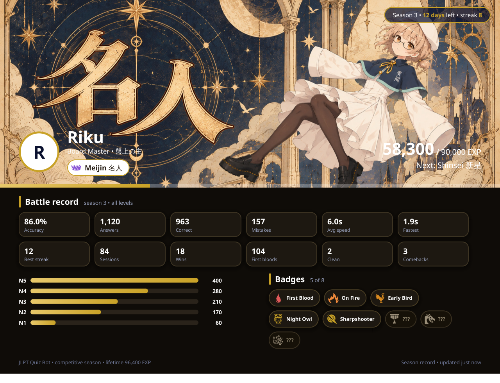
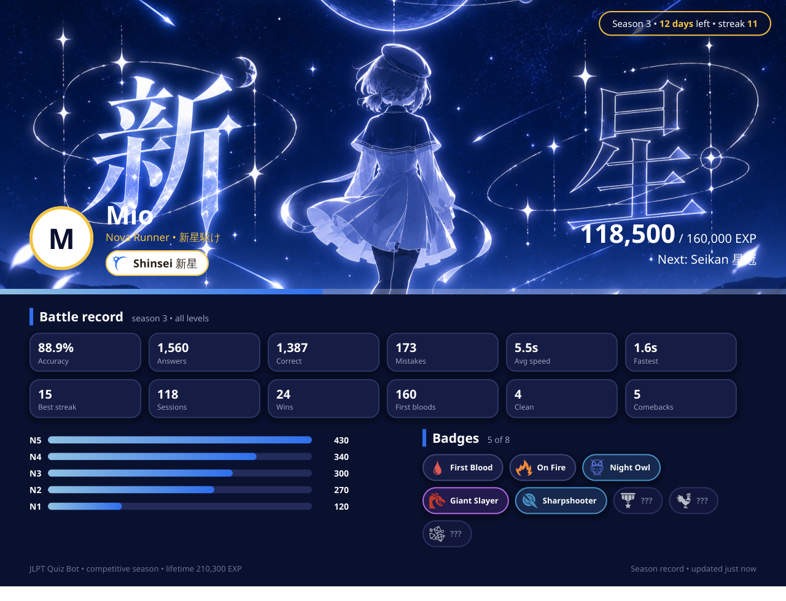
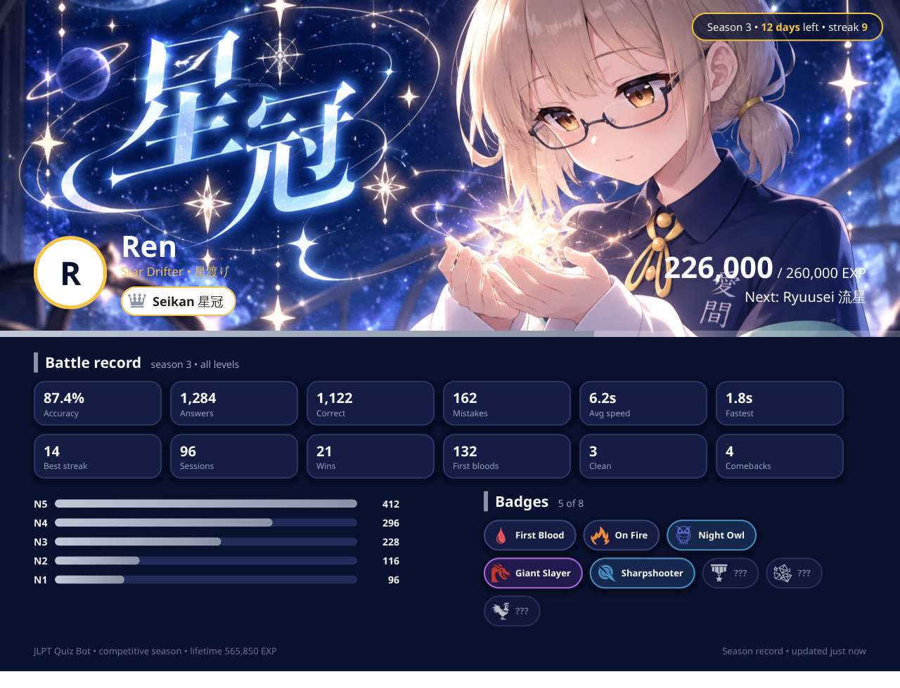
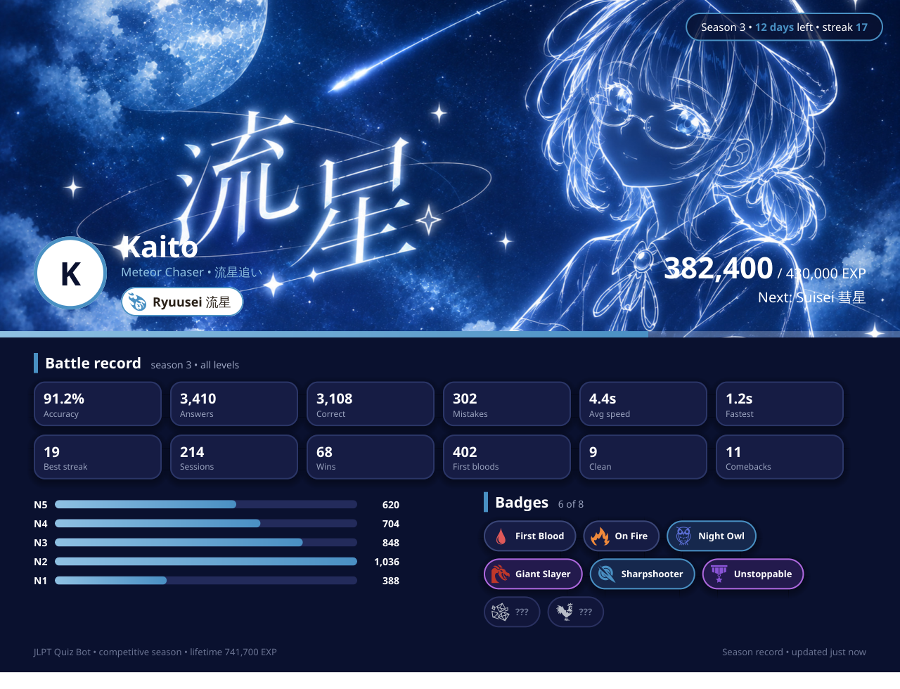
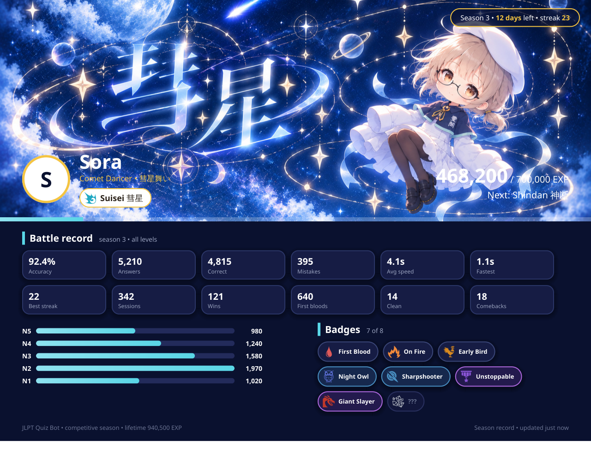
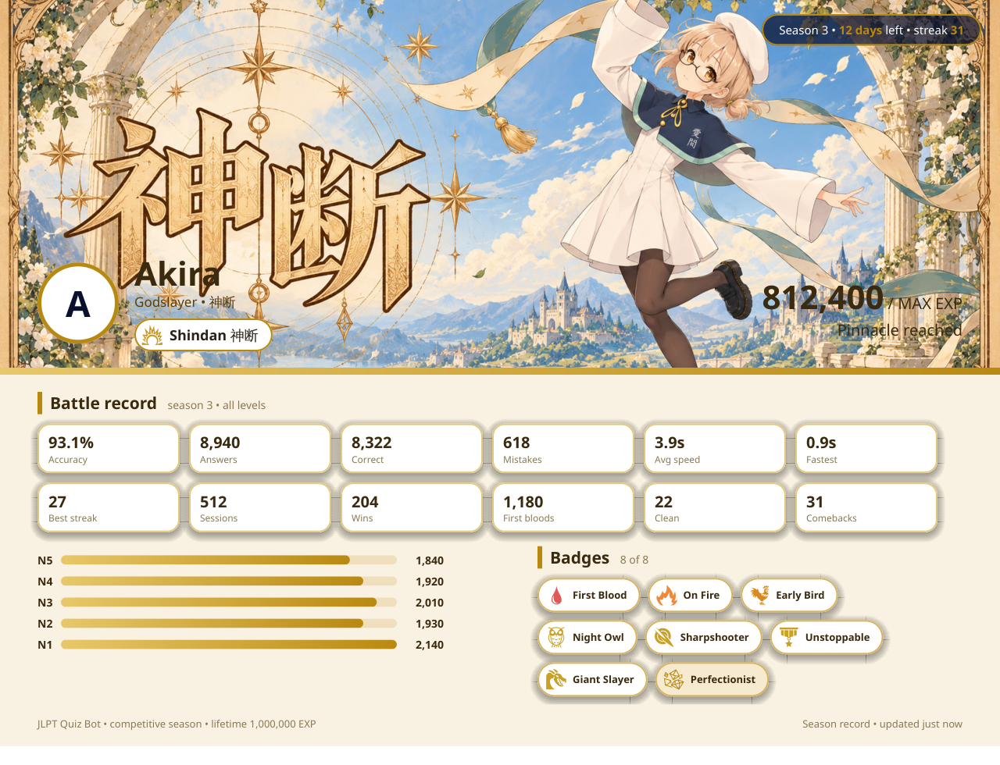

# jlpt-dojo — Free JLPT Quiz Discord Bot (N5–N1)

[](https://github.com/philiaspaceai/jlpt-dojo/actions/workflows/ci.yml)
[](https://www.python.org/)
[](https://discordpy.readthedocs.io/)
[](LICENSE)


Practice for the **Japanese-Language Proficiency Test (JLPT N5, N4, N3, N2, N1)**
right inside Discord. **4,300+ Japanese quiz questions** covering kanji reading,
vocabulary, grammar and reading comprehension, wrapped in a competitive game:
10 ranks from Houga to Shindan, EXP, speed and streak bonuses, collectible
badges, seasonal leaderboard resets, and rendered profile cards.

Perfect for Japanese learners, JLPT study groups, and Discord servers that want
a daily kanji and bunpou drill with friends.

Built on **discord.py 2.7.1** exactly as documented in `docs/discord-py/`
(`api.md`, `ext-commands-api.md`, `ext-tasks-index.md`, `interactions-api.md`).

## Profile card previews

<table>
  <tr>
    <td></td>
    <td></td>
  </tr>
  <tr>
    <td></td>
    <td></td>
  </tr>
  <tr>
    <td></td>
    <td></td>
  </tr>
</table>

## Features

- `/jq start` opens a setup embed: level (N5–N1/ALL), question category
  (Vocabulary / Grammar / Reading, bilingual labels), count (5/10/15/20).
- Questions are random every session (`random.sample`).
- Anti pattern-recognition: options are shuffled per session and the
  correct index is remapped. The original order is never sent to Discord.
- Fastest finger wins: the **first press decides each question** (correct +1,
  wrong = mistake +1) and advances immediately — brute-forcing all four
  options is impossible. Mistakes never cost EXP.
- New pipeline per question: buttons stripped (content stays) → reveal message
  with the correct answer → next question as a new message (full history).
- One active session per process, single server + single channel enforced.
- Buttons `1/2/3/4` + `Stop` (starter or server admin with
  `Administrator`/`Manage Guild`). Idle 5 minutes auto-closes.
- Session-only leaderboard embed when the quiz ends.
- **Competitive ranks** (Houga → Shindan, 10 tiers) with level-scaled EXP,
  level quotas, trials for ranks 8–10, season reset every 2 months.
- **Badges**: 10 collectible, 8 display slots managed via `/jq badge`.
- **Profile cards** (`/jq me`, `/jq profile`) rendered as 16:9 PNGs;
  `/jq leaderboard` (season top 10), `/jq info` (guide, ephemeral).
- Full logs to `log.txt` plus console.

## Quick start

Requirements: Python 3.14, `uv`.

```bash
cp .env.example .env
# edit .env with your token and IDs
uv sync
uv run pytest
uv run jlpt-dojo
```

Or use the launcher (used by systemd on the VPS):

```bash
./start.sh
```

## Configuration (.env)

| Key | Required | Example |
| --- | --- | --- |
| `DISCORD_TOKEN` | yes | bot token (never commit) |
| `JLPT_GUILD_ID` | yes | your guild id (never commit real id) |
| `JLPT_CHANNEL_ID` | yes | your channel id (never commit real id) |
| `JLPT_DATA_DIR` | no | `data` |
| `JLPT_LOG_PATH` | no | `log.txt` |
| `JLPT_IDLE_TIMEOUT_SEC` | no | `300` |
| `JLPT_DB_PATH` | no | `db/quiz.db` |
| `JLPT_ARCHIVE_DIR` | no | `db/archive` |
| `JLPT_CONFIG_PATH` | no | `config.yaml` |

All progression numbers (ranks, EXP, gates, trials, bonuses, badges) live in
`config.yaml` — tune there, never in code. The season database is a single
SQLite file; on season rollover the whole file is archived to
`db/archive/quiz-season-N.db` and a fresh one starts (lifetime = current +
archives).

## Architecture

Modular monolith with one-way dependencies (blast radius isolation):

```
quiz_cog.py / views.py / embeds.py / bot.py   (discord layer)
  -> quiz.py                                   (session state machine, pure)
    -> store.py / models.py                    (data, pure)
      -> config.py
```

- `config.py`, `store.py`, `quiz.py`, `categories.py` never import `discord`:
  testable without a connection.
- `embeds.py` owns every `discord.Embed`.
- `views.py` owns every `discord.ui.View/Select/Button`.
- `quiz_cog.py` owns `/jq start` and the `tasks.loop` idle watcher.
- `QuizManager` enforces a single active session with `asyncio.Lock`.

Pipeline: `start.sh` → `uv run jlpt-dojo` → load settings + JSON →
`/jq start` (guard) → setup view → sample + shuffle → per-question
embed + fresh `QuizView` → first correct +1 auto-next → leaderboard →
cleanup. Idle watcher (`tasks.loop(30s)`) closes sessions idle over
`JLPT_IDLE_TIMEOUT_SEC`.

## Data format

See `data/template.md`. Each JSON item:

`id, instruction, passage|null, stem, target|null, options[4], answer(1-4), correctOrder|null`

`passage` is shared reading text (or null). `target` is the underlined
word asked about. `correctOrder` is for star-ordering questions.

## Tests

```bash
uv run pytest -v
```

- `test_store`: loading, mondai grouping, sampling bounds.
- `test_shuffle`: shuffled answer stays correct, positions vary.
- `test_quiz`: first-correct-wins, wrong ignored, stale ignored,
  single-session enforcement, stop permission.
- `test_guards`: server/channel guard + settings validation.
- `test_embeds`: embed size limits.

## Deploy (VPS + systemd)

VPS layout mirrors other bots (`ruri`, `hinari`, `ayumi`, `phix`):

- Code: `/root/jlpt-dojo`
- Env: `/root/jlpt-dojo/.env` (token lives only here)
- Service: `/etc/systemd/system/jlpt-dojo.service` (from `systemd/jlpt-dojo.service`)

```bash
sudo cp systemd/jlpt-dojo.service /etc/systemd/system/jlpt-dojo.service
sudo systemctl daemon-reload
sudo systemctl enable --now jlpt-dojo
journalctl -u jlpt-dojo -f
tail -f /root/jlpt-dojo/log.txt
```

GitHub Actions (`.github/workflows/`): `ci.yml` runs pytest;
`deploy.yml` pulls `/root/jlpt-dojo` and restarts only the
`jlpt-dojo` service via SSH key secrets. The Discord token is never
stored in git or in workflow files.

## License

MIT — see [LICENSE](LICENSE). Rank and badge icons by [game-icons.net](https://game-icons.net/)
(Lorc, Delapouite, Carl Olsen, sbed, CC-BY 3.0).
